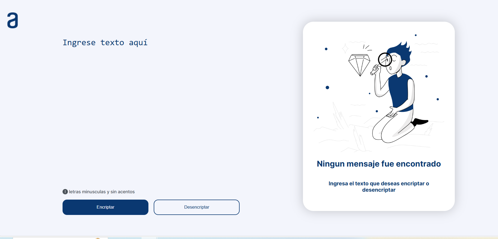
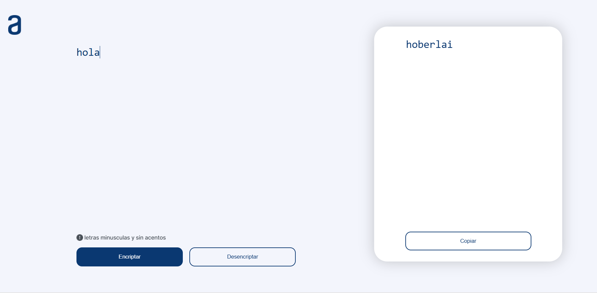

# Alura_challenge_encriptador

# Explicacion

Este challenge consiste en crear una pagina web en base a las especificaciones dadas por el figma y trello,
el encriptado consiste en recibir un texto y transformarlo usando una serie de expresiones regulares, para asi encriptar el texto entregado, de la misma forma, podemos entregar un texto encriptado y desencriptarlo a conveniencia

# Visualización

Aca se puede ver como el texto "hola" es transformado en el "hoberlai"

